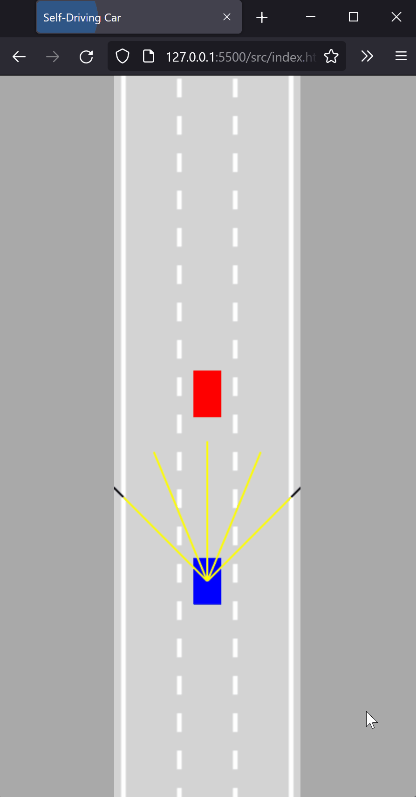

# Self-driving Car

A self-driving car that uses neural networks and machine learning to move without colliding with other cars or objects.



# How to use

Open the url: https://pncsoares.github.io/self-driving-car/src

<s>- [x] Move the car with the arrow keys ⬆️➡️⬇️⬅️ ]</s>
- [x] Refresh the page and watch the car driving like a Tesla but without colliding to other vehicles or walls 😆

# Checklist

- [x] Car driving mechanics
- [x] Road definition
- [x] Artificial sensors
- [x] Collision detection
- [x] Traffic simulation
- [x] Neural network
- [x] Visualizing neural networks
- [ ] Optimizing neural networks
- [ ] Fine-tuning

# Technologies

- [HTML](https://developer.mozilla.org/en-US/docs/Web/HTML)
- [CSS](https://developer.mozilla.org/en-US/docs/Web/CSS)
- [JavaScript](https://developer.mozilla.org/en-US/docs/Web/JavaScript)

# Setup

## Clone repository

Create and go to the directory where you want to place the repository

```bash
  cd my-directory
```

Clone the project

```bash
  git clone https://github.com/pncsoares/self-driving-car.git
```

Go to the project directory

```bash
  cd self-driving-car
```

Open in Visual Studio Code

```bash
  code .
```

# License

MIT